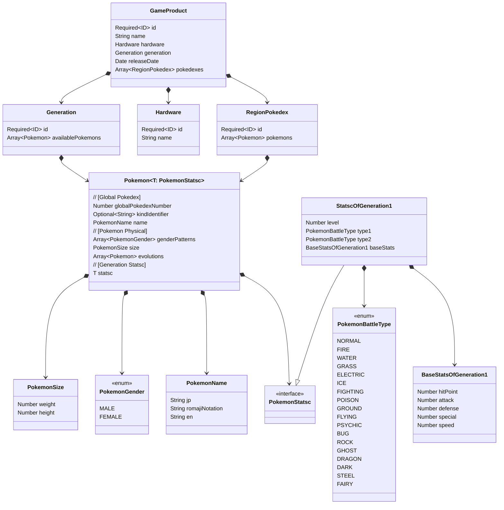

# pokemon-doc

```mermaid
classDiagram

    class Pokemon~T: PokemonStatsc~ {
        // [Global Pokedex]
        Number globalPokedexNumber
        Optional~String~ kindIdentifier
        PokemonName name

        // [Pokemon Physical]
        Array~PokemonGender~ genderPatterns
        PokemonSize size
        Array~Pokemon~ evolutions

        // [Generation Statsc]
        T statsc
    }
    Pokemon *--> PokemonSize
    Pokemon *--> PokemonGender
    Pokemon *--> PokemonName
    Pokemon *--> PokemonStatsc

    class PokemonSize {
        Number weight
        Number height
    }

    class PokemonGender {
        <<enum>>
        MALE
        FEMALE
    }

    class PokemonName {
        String jp
        String romajiNotation
        String en
    }

    class Generation {
        Required~ID~ id
        Array~Pokemon~ availablePokemons
    }
    Generation *--> Pokemon

    class PokemonStatsc {
        <<interface>>
    }

    class StatscOfGeneration1 {
        Number level
        PokemonBattleType type1
        PokemonBattleType type2
        BaseStatsOfGeneration1 baseStats
    }
    StatscOfGeneration1 --|> PokemonStatsc
    StatscOfGeneration1 *--> PokemonBattleType
    StatscOfGeneration1 *--> BaseStatsOfGeneration1

    class GameProduct {
        Required~ID~ id
        String name
        Hardware hardware
        Generation generation
        Date releaseDate
        Array~RegionPokedex~ pokedexes
    }
    GameProduct *--> Hardware
    GameProduct *--> Generation
    GameProduct *--> RegionPokedex

    class PokemonBattleType {
        <<enum>>
        NORMAL
        FIRE
        WATER
        GRASS
        ELECTRIC
        ICE
        FIGHTING
        POISON
        GROUND
        FLYING
        PSYCHIC
        BUG
        ROCK
        GHOST
        DRAGON
        DARK
        STEEL
        FAIRY
    }

    class BaseStatsOfGeneration1 {
        Number hitPoint
        Number attack
        Number defense
        Number special
        Number speed
    }

    class Hardware {
        Required~ID~ id
        String name
    }

    class RegionPokedex {
        Required~ID~ id
        Array~Pokemon~ pokemons
    }
    RegionPokedex *--> Pokemon
```
