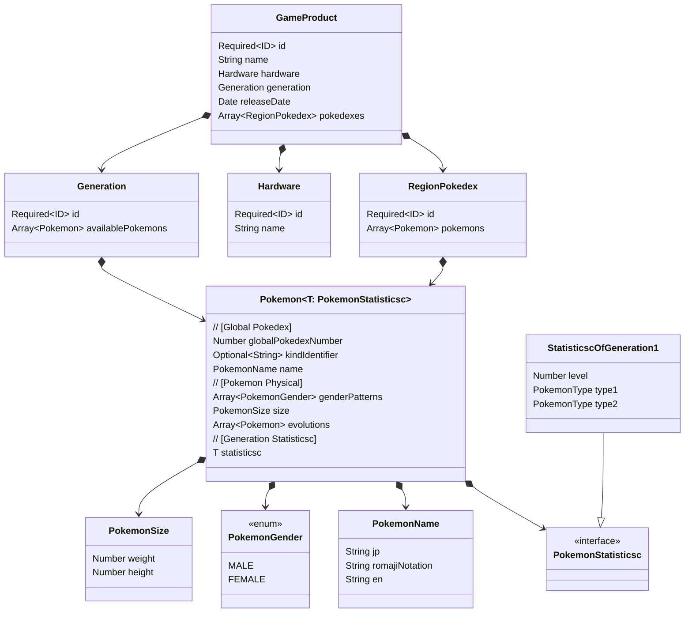

```mermaid
classDiagram

    class Pokemon~T: PokemonStatisticsc~ {
        // [Global Pokedex]
        Number globalPokedexNumber
        Optional~String~ kindIdentifier
        PokemonName name

        // [Pokemon Physical]
        Array~PokemonGender~ genderPatterns
        PokemonSize size
        Array~Pokemon~ evolutions

        // [Generation Statisticsc]
        T statisticsc
    }
    Pokemon *--> PokemonSize
    Pokemon *--> PokemonGender
    Pokemon *--> PokemonName
    Pokemon *--> PokemonStatisticsc

    class PokemonSize {
        Number weight
        Number height
    }

    class PokemonGender {
        <<enum>>
        MALE
        FEMALE
    }

    class PokemonName {
        String jp
        String romajiNotation
        String en
    }

    class Generation {
        Required~ID~ id
        Array~Pokemon~ availablePokemons
    }
    Generation *--> Pokemon

    class PokemonStatisticsc {
        <<interface>>
    }

    class StatisticscOfGeneration1 {
        Number level
        PokemonType type1
        PokemonType type2
    }
    StatisticscOfGeneration1 --|> PokemonStatisticsc

    class GameProduct {
        Required~ID~ id
        String name
        Hardware hardware
        Generation generation
        Date releaseDate
        Array~RegionPokedex~ pokedexes
    }
    GameProduct *--> Hardware
    GameProduct *--> Generation
    GameProduct *--> RegionPokedex

    class Hardware {
        Required~ID~ id
        String name
    }

    class RegionPokedex {
        Required~ID~ id
        Array~Pokemon~ pokemons
    }
    RegionPokedex *--> Pokemon
```
