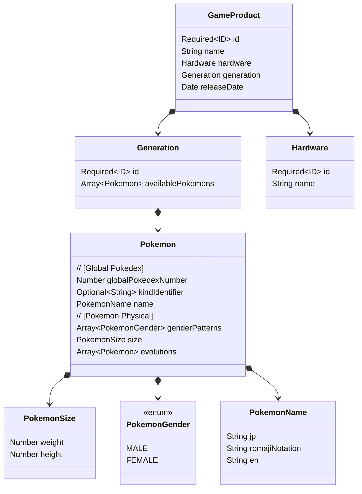

```mermaid
classDiagram

    class Pokemon {
        // [Global Pokedex]
        Number globalPokedexNumber
        Optional~String~ kindIdentifier
        PokemonName name

        // [Pokemon Physical]
        Array~PokemonGender~ genderPatterns
        PokemonSize size
        Array~Pokemon~ evolutions
    }
    Pokemon *--> PokemonSize
    Pokemon *--> PokemonGender
    Pokemon *--> PokemonName

    class PokemonSize {
        Number weight
        Number height
    }

    class PokemonGender {
        <<enum>>
        MALE
        FEMALE
    }

    class PokemonName {
        String jp
        String romajiNotation
        String en
    }

    class Generation {
        Required~ID~ id
        Array~Pokemon~ availablePokemons
    }
    Generation *--> Pokemon    

    class GameProduct {
        Required~ID~ id
        String name
        Hardware hardware
        Generation generation
        Date releaseDate
    }
    GameProduct *--> Hardware
    GameProduct *--> Generation

    class Hardware {
        Required~ID~ id
        String name
    }
```
