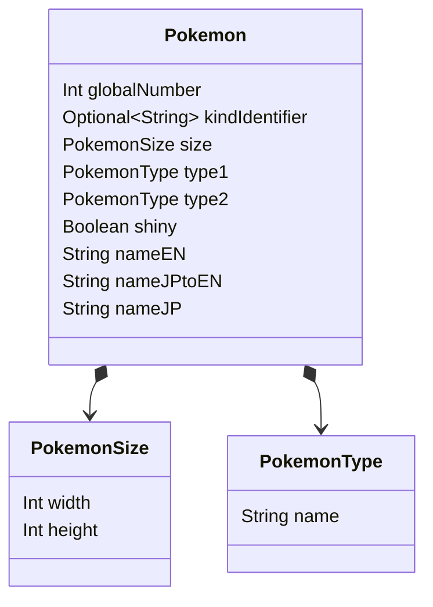

```mermaid
classDiagram

    class Pokemon {
        Int globalNumber
        Optional~String~ kindIdentifier
        PokemonSize size
        PokemonType type1
        PokemonType type2
        Boolean shiny
        String nameEN
        String nameJPtoEN
        String nameJP
    }
    Pokemon *--> PokemonSize
    Pokemon *--> PokemonType

    class PokemonSize {
        Int width
        Int height
    }

    class PokemonType {
        String name
    }
```
