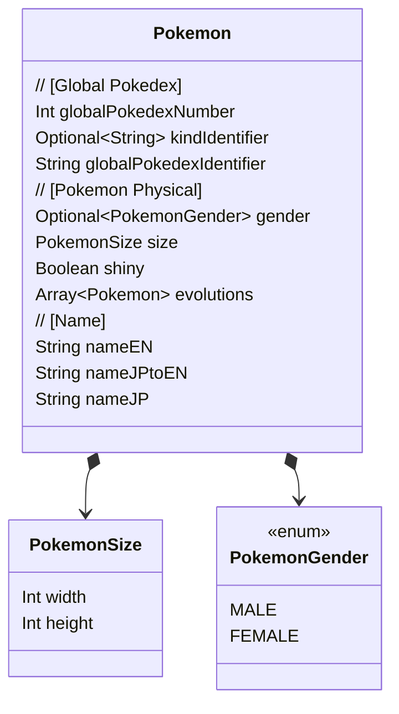

```mermaid
classDiagram

    class Pokemon {
        // [Global Pokedex]
        Int globalPokedexNumber
        Optional~String~ kindIdentifier
        String globalPokedexIdentifier
        // [Pokemon Physical]
        Optional~PokemonGender~ gender
        PokemonSize size
        Boolean shiny
        Array~Pokemon~ evolutions
        // [Name]
        String nameEN
        String nameJPtoEN
        String nameJP
    }
    Pokemon *--> PokemonSize
    Pokemon *--> PokemonGender

    class PokemonSize {
        Int width
        Int height
    }

    class PokemonGender {
        <<enum>>
        MALE
        FEMALE
    }
```
