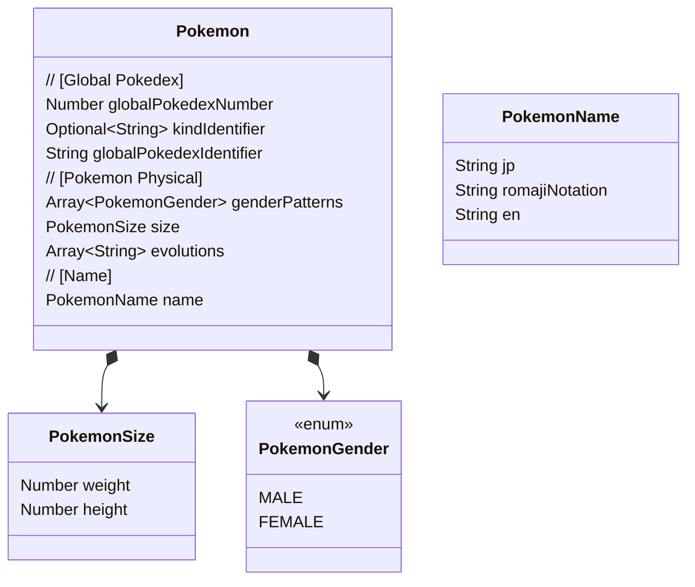

```mermaid
classDiagram

    class Pokemon {
        // [Global Pokedex]
        Number globalPokedexNumber
        Optional~String~ kindIdentifier
        String globalPokedexIdentifier

        // [Pokemon Physical]
        Array~PokemonGender~ genderPatterns
        PokemonSize size
        Array~String~ evolutions

        // [Name]
        PokemonName name
    }
    Pokemon *--> PokemonSize
    Pokemon *--> PokemonGender

    class PokemonSize {
        Number weight
        Number height
    }

    class PokemonGender {
        <<enum>>
        MALE
        FEMALE
    }

    class PokemonName {
        String jp
        String romajiNotation
        String en
    }
```
